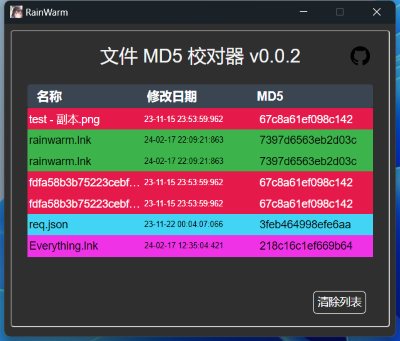
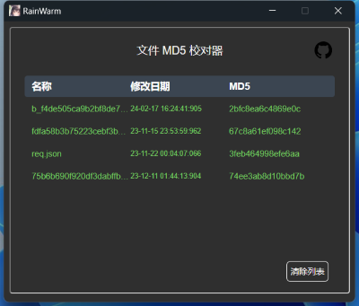

    

# License
Do whatever you want with it!

# ChangLog

- v0.0.6
    - 新增移除文件按钮

- v0.0.5
    - 新增检查更新

- v0.0.4
    - 新增系统托盘(systemTray)

- v0.0.3
    - 使用 spark-md5 在前端计算 MD5

- v0.0.2
    - MD5 相同的文件会标注相同的颜色
    - 

- v0.0.1
    - 能跑了
    - 
